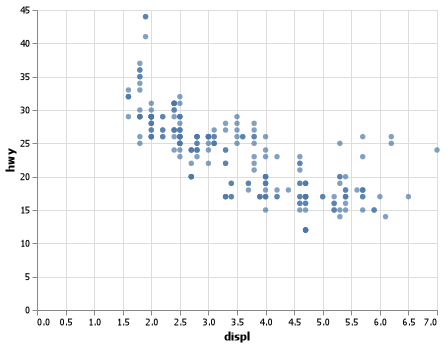

# Project0

__Hajdi Isufi__

## Project Summary

In this project we are lerning how to download data, in this case mpg data and try to learn more about altair and visualisations. 

#### Grand Question 1




In this project I learnt more about altair and its visualisation methods. I learnt how to do a dot graph and the code for it is down.


#### Grand Question 2

Your final report should also include the markdown table created from the following code. 

| manufacturer   | model   |   year |   hwy |
|:---------------|:--------|-------:|------:|
| audi           | a4      |   1999 |    29 |
| audi           | a4      |   1999 |    29 |
| audi           | a4      |   2008 |    31 |
| audi           | a4      |   2008 |    30 |
| audi           | a4      |   1999 |    26 |


```python
#%%
import pandas as pd
import altair as alt
import numpy as np

mpg_data = pd.read_csv('mpg.csv')

# Chart

chart = (alt.Chart(mpg_data)
    .encode(
        x="displ",
        y="hwy",)
        .mark_circle()
)

chart.save("project0_chart.png")


# %%


print(mpg_data
    .head(5)
    .filter(["manufacturer", "model","year", "hwy"])
    .to_markdown(index=False))


# %%

```