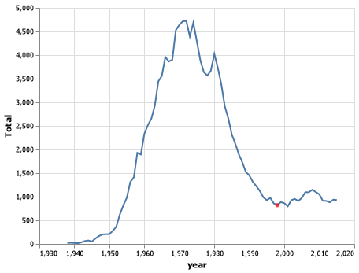
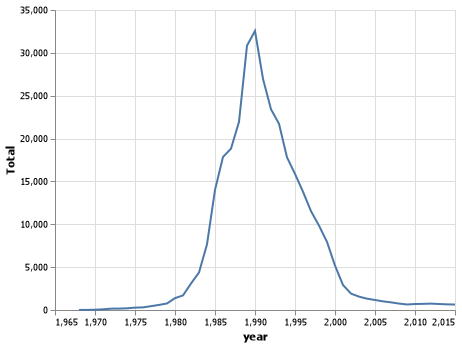
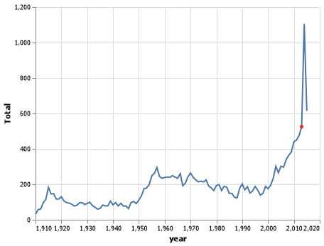

# Project 1

__Hajdi Isufi__

## Project Background

Early in prehistory, some descriptive names began to be used again and again until they formed a name pool for a particular culture. Parents would choose names from the pool of existing names rather than invent new ones for their children.

With the rise of Christianity, certain trends in naming practices manifested. Christians were encouraged to name their children after saints and martyrs of the church. These early Christian names can be found in many cultures today, in various forms. These were spread by early missionaries throughout the Mediterranean basin and Europe.

By the Middle Ages, the Christian influence on naming practices was pervasive. Each culture had its pool of names, which were a combination of native names and early Christian names that had been in the language long enough to be considered native.

## Project Summary

In this project I was able to find more about different types of names. I read about altair charts and was able to graph those names and the years that were chosen. It was really fun to be able to see how different names change over time.

## Technical Details

_In this section, you will:_

- _Have subheaders for each grand question, like the ones below._

#### Grand Question 1
How does your name at your birth year compare to its use historically?



I used my name as Heidi, just because that is much easier spelling for english. 

#### Grand Question 2
If you talked to someone named Brittany on the phone, what is your guess of his or her age? What ages would you not guess?



#### Grand Question 3
Mary, Martha, Peter, and Paul are all Christian names. From 1920 to 2000, compare the name usage of each of the four names.


#### Grand Question 4
Think of a unique name from a famous movie. Plot the usage of that name and see how changes line up with the movie release.




s = pd.Series(["elk", "pig", "dog", "quetzal"], name="animal")
print(s.to_markdown())
|    | animal   |
|---:|:---------|
|  0 | elk      |
|  1 | pig      |
|  2 | dog      |
|  3 | quetzal  |
```

|    | animal   |
|---:|:---------|
|  0 | elk      |
|  1 | pig      |
|  2 | dog      |
|  3 | quetzal  |


## Appendix A

_This is where your python script will go. Your code should be commented and well organized._

```python
import pandas as pd
import altair as alt
import numpy as np
names = pd.read_csv('https://raw.githubusercontent.com/byuidatascience/data4names/master/data-raw/names_year/names_year.csv')

#Question 1

q1_data = names.query("name == ['Heidi']")
q1_data1 =q1_data.query("year == 1998")
graph1 = (alt.Chart(q1_data).encode(
    x= 'year',
    y ='Total'
).mark_line()
)
graph2 = alt.Chart(q1_data1).encode(
    x = 'year',
    y= 'Total'
).mark_circle(color ='red')

graph3 =graph1 + graph2

graph3.save("project1q1_chart.png")

#Question 2
q2_data = names.query("name == ['Brittany']")
graph = (alt.Chart(q2_data).encode(
    x= 'year',
    y ='Total'
).mark_line()
)
graph.save("project1q2_chart.png")


#Question 3

q3_data = names.query("name == ['Mary','Martha','Peter','Paul'] & year >= 1920 & year <= 2000")
graph4 =alt.Chart(q3_data).encode(
    x= 'year',
    y ='Total',
    color = 'name',
    strokeDash = 'name'
).mark_line()

graph4.save("project1q3_chart.png")


#Question 4

q4_data = names.query("name == ['Elsa']")
q4_data1 =q4_data.query("year == 2013")
graph5 = (alt.Chart(q4_data).encode(
    x= 'year',
    y ='Total'
).mark_line()
)
graph6 = alt.Chart(q4_data1).encode(
    x = 'year',
    y= 'Total'
).mark_circle(color ='red')

graph7 =graph5 + graph6

graph7.save("project1q4_chart.png")
```