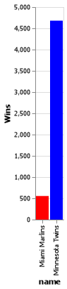

# Project 3

__Hajdi Isufi__

_This `.md` file should be used to finalize your report. You will need to compile the report into a `.pdf` document and submit it on canvas._

_Use the [Markdown Preview Enhanced](https://marketplace.visualstudio.com/items?itemName=shd101wyy.markdown-preview-enhanced) VS Code extension to work with Markdown files (`.md`)._

## Project Background

When you hear the word “relationship” what is the first thing that comes to mind? Probably not baseball. But a relationship is simply a way to describe how two or more objects are connected. There are many relationships in baseball such as those between teams and managers, players and salaries, even stadiums and concession prices. The graphs on Data Visualizations from Best Tickets show many other relationships that exist in baseball.

For this project, your client would like developed SQL queries that they can use to retreive data for use on their website without needing Python. They would also like to see an example Altair chart.

## Project Summary

In this project I learnt a lot about SQL. We used SQL to call certain parts of the tables so we don't have to use the whole table. I was trying to learn more about baseball data and how it looked like.

## Technical Details

_In this section, you will:_

- _Have subheaders for each grand question, like the ones below._

#### Grand Question 1
Write an SQL query to create a new dataframe about baseball players who attended BYU-Idaho. The new table should contain five columns: playerID, schoolID, salary, and the yearID/teamID associated with each salary. Order the table by salary (highest to lowest) and print out the table in your report.

|    | playerID   | schoolID   |         salary |   yearID | teamID   |
|---:|:-----------|:-----------|---------------:|---------:|:---------|
|  0 | lindsma01  | idbyuid    |      4e+06     |     2014 | CHA      |
|  1 | lindsma01  | idbyuid    |      3.6e+06   |     2012 | BAL      |
|  2 | lindsma01  | idbyuid    |      2.8e+06   |     2011 | COL      |
|  3 | lindsma01  | idbyuid    |      2.3e+06   |     2013 | CHA      |
|  4 | lindsma01  | idbyuid    |      1.625e+06 |     2010 | HOU      |
|  5 | stephga01  | idbyuid    |      1.025e+06 |     2001 | SLN      |
|  6 | stephga01  | idbyuid    | 900000         |     2002 | SLN      |
|  7 | stephga01  | idbyuid    | 800000         |     2003 | SLN      |
|  8 | stephga01  | idbyuid    | 550000         |     2000 | SLN      |
|  9 | lindsma01  | idbyuid    | 410000         |     2009 | FLO      |
| 10 | lindsma01  | idbyuid    | 395000         |     2008 | FLO      |
| 11 | lindsma01  | idbyuid    | 380000         |     2007 | FLO      |
| 12 | stephga01  | idbyuid    | 215000         |     1999 | SLN      |
| 13 | stephga01  | idbyuid    | 185000         |     1998 | PHI      |
| 14 | stephga01  | idbyuid    | 150000         |     1997 | PHI      |

#### Grand Question 2

This three-part question requires you to calculate batting average (number of hits divided by the number of at-bats)

Write an SQL query that provides playerID, yearID, and batting average for players with at least 1 at bat that year. Sort the table from highest batting average to lowest, and then by playerid alphabetically. Show the top 5 results in your report.

Use the same query as above, but only include players with at least 10 at bats that year. Print the top 5 results.

Now calculate the batting average for players over their entire careers (all years combined). Only include players with at least 100 at bats, and print the top 5 results.

#### Grand Question 3

Pick any two baseball teams and compare them using a metric of your choice (average salary, home runs, number of wins, etc). Write an SQL query to get the data you need, then make a graph in Altair to visualize the comparison.

In this chart I took two different teams and calculated the total number of wins they had.